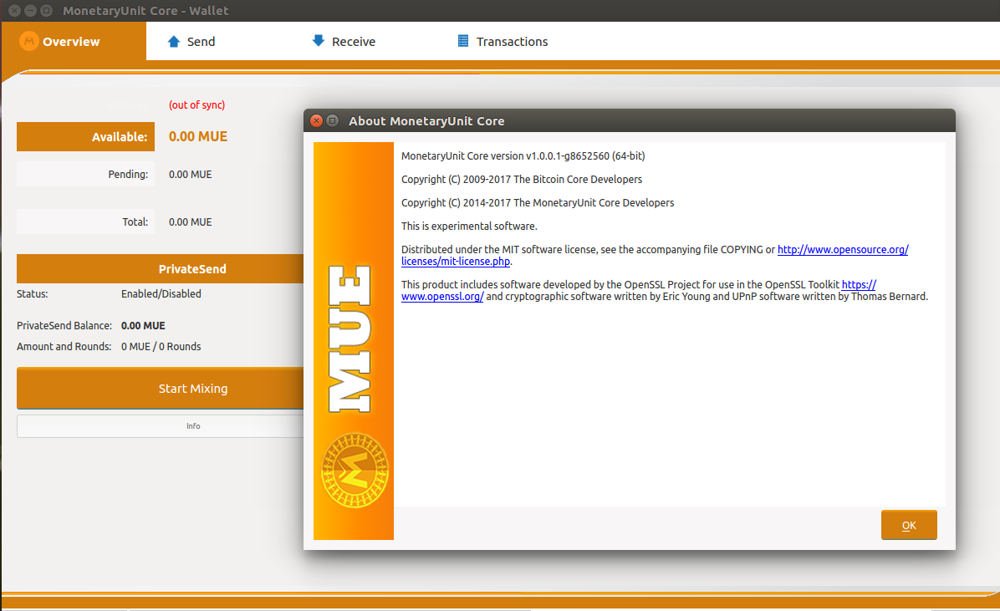

# Building the MonetaryUnit client wallet on Ubuntu Linux 16.04 LTS

If a user does not want to run the provided binaries from the Monetaryunit project, the client wallet can be built on the Ubuntu Linux desktop by following this guide.

Open up the terminal and follow the commands below. This sets up the building environment and adds the necessary dependencies for the MUE wallet:

    sudo apt-get update
    sudo apt-get upgrade

    sudo apt-get install build-essential libtool autotools-dev autoconf pkg-config libssl-dev libevent-dev
    sudo apt-get install libboost-all-dev
    sudo apt-get install libqt5gui5 libqt5core5a libqt5dbus5 qttools5-dev qttools5-dev-tools libprotobuf-dev protobuf-compiler git
    sudo apt-get install libqrencode-dev
    sudo apt-get install libminiupnpc-dev
    sudo add-apt-repository ppa:bitcoin/bitcoin -y
    sudo apt-get update -y
    sudo apt-get install libdb4.8-dev libdb4.8++-dev -y

### Download the MUE source code

    cd ~
    git clone https://github.com/monetaryunit/MUE-X11/mue.git

### Configure and compile the MUE wallet

    cd MUE-X11/
    ./autogen.sh && ./configure --with-incompatible-bdb --without-miniupnpc && make -j8 && sudo make install

The value -j8 tells the compiler to use 8 threads for the compiling. If your processor has fewer or more cores, set the value to speed up the compiling, one thread per processor core, eg -j2, -j4, -j16.

### Run the MUE Daemon/QT/Client

    ./src/mued -daemon
    ./src/mue-qt
    ./src/mue-cli

Congratulations! Your MonetaryUnit QT-wallet is all ready for use.
