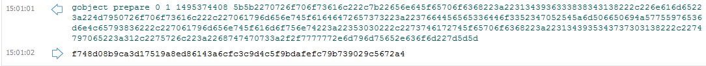
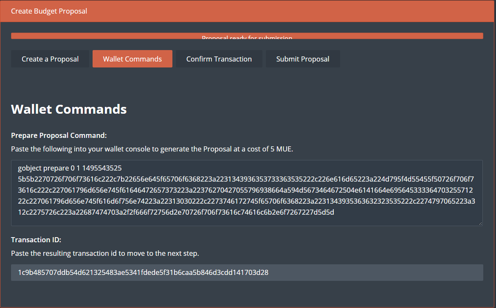
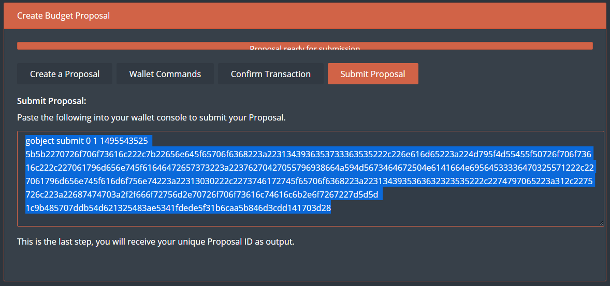
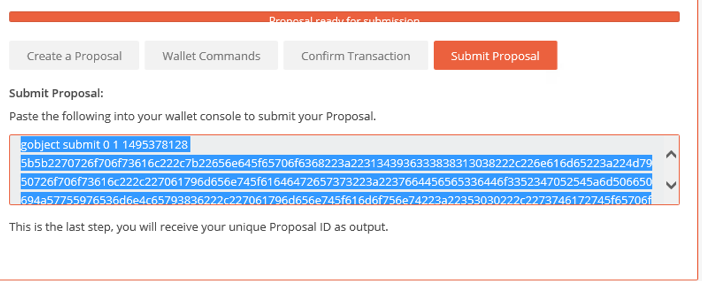

# Making a proposal with the MonetaryUnit QT wallet

The MonetaryUnit network has adopted a governing model where a 10% portion of the block rewards are used to fund proposals that benefit the MonetaryUnit network and community. It is currently necessary to manually make a proposal with the QT wallet before submitting a proposal output - for the masternode operators to vote for or against. Please see the steps below on how to make a proposal and getting it submitted to the network!

## Initiating a proposal

Let's start by going the MyMue proposal page: https://www.mymue.com/
Create an account and make sure to setup two-factor authentication, 2fa, for your increased security.

Next, please go to the proposal page; https://www.mymue.com/Home/CreateProposal
where we will start by filling in the requested fields and start generating a proposal for the masternode network.

You will need to fill in

    Proposal Name:
    Proposal Description URL:
    Payment Address:

And select

    Payment Date:
    Payments:

So as an example:

It is easy and pretty straightforward to fill out the form. In the fields,

* `Payment Amount:` this is how much you want to be paid on each *superblock*
* `Payments:`  This is how many payments you want to receive.
* `Payment Address:` Your address where payment will be sent to
* `Total Amount:` 5000 MUE with a final payment on 6/1/2017

The output here would lead to the proposal being paid 500 MUE, for 10 times, making a total of 5000 MUE.

So after you have filled in the boxes hit

And it will take you to the next page, and the next step

## Pasting outputs in the QT-wallet

The next step is to paste the outputs from the proposal page into the console of the QT-wallet.

Copy the `output` and paste it in the `wallet console`

Hit `Enter` and in the console you will get a new output, that we will need for the next step:

The output in this example:    

  __1c9b485707ddb54d621325483ae5341fdede5f31b6caa5b846d3cdd141703d28__

will be needed for the next step back on the proposal page.

You can verify that a transaction has been made for the proposal, for the live mainnet the cost for a proposal is set to 500 MUE. For the current testing the fee has been set to 5 MUE. Please wait for six (6) confirmations (about 2.5 minutes) before proceeding with the next step.

# Proceeding on the Proposal page

The output from the QT-wallet `1c9b485707ddb54d621325483ae5341fdede5f31b6caa5b846d3cdd141703d28`
needs to be pasted in the proposal page in the field underneath the `Transaction ID:`
Submit this value and then proceed with the next step.

After pasting in the `transaction id value`, copy the output from the `Submit Proposal` tab on the Proposal page.
Go back to your QT-wallet console, and paste the new output in the console again. This will generate a `Proposal ID` that is used for voting on the new proposal.

Copy the output once again and paste it into your wallet console:

this will give you this

__ec6156877ffccfc9b5b99101a13c673b9ce856bcd9909a2fec9f2bb2af7a72b8__

For the network to vote on your proposal, you need to provide the correct `Proposal ID` commands:

For yes:

    gobject vote-many ec6156877ffccfc9b5b99101a13c673b9ce856bcd9909a2fec9f2bb2af7a72b8 funding yes

or, no:

    gobject vote-many ec6156877ffccfc9b5b99101a13c673b9ce856bcd9909a2fec9f2bb2af7a72b8 funding no

now depending on how many masternodes you have the out will vary. Here is the output for a 3 masternode setup:

    {
      "overall": "Voted successfully 3 time(s) and failed 0 time(s).",
      "detail": {
        "MN1": {
          "result": "success"
        },
        "MN2": {
          "result": "success"
        },
        "MN3": {
          "result": "success"
        }
      }
    }

--------------------------------------------------------------

# Check the Proposal status

To check how your proposal is doing you can check it with this command

    gobject get ec6156877ffccfc9b5b99101a13c673b9ce856bcd9909a2fec9f2bb2af7a72b8

    {
      "DataHex": "5b5b2270726f706f73616c222c7b22656e645f65706f6368223a2231343936353733363535222c226e616d65223a224d795f4d55455f50726f706f73616c222c227061796d656e745f61646472657373223a22376270427055796938664a594d5673464672504e6141664e69564533336470325571222c227061796d656e745f616d6f756e74223a22313030222c2273746172745f65706f6368223a2231343935363632323535222c2274797065223a312c2275726c223a22687474703a2f2f666f72756d2e70726f706f73616c74616c6b2e6f7267227d5d5d",
      "DataString": "[[\"proposal\",{\"end_epoch\":\"1496573655\",\"name\":\"My_MUE_Proposal\",\"payment_address\":\"7bpBpUyi8fJYMVsFFrPNaAfNiVE33dp2Uq\",\"payment_amount\":\"100\",\"start_epoch\":\"1495662255\",\"type\":1,\"url\":\"http://forum.proposaltalk.org\"}]]",
      "Hash": "ec6156877ffccfc9b5b99101a13c673b9ce856bcd9909a2fec9f2bb2af7a72b8",
      "CollateralHash": "1c9b485707ddb54d621325483ae5341fdede5f31b6caa5b846d3cdd141703d28",
      "ObjectType": 1,
      "CreationTime": 1495543525,
      "FundingResult": {
        "AbsoluteYesCount": 3,
        "YesCount": 3,
        "NoCount": 0,
        "AbstainCount": 0
      },
      "ValidResult": {
        "AbsoluteYesCount": 0,
        "YesCount": 0,
        "NoCount": 0,
        "AbstainCount": 0
      },
      "DeleteResult": {
        "AbsoluteYesCount": 0,
        "YesCount": 0,
        "NoCount": 0,
        "AbstainCount": 0
      },
      "EndorsedResult": {
        "AbsoluteYesCount": 0,
        "YesCount": 0,
        "NoCount": 0,
        "AbstainCount": 0
      },
      "fLocalValidity": true,
      "IsValidReason": "",
      "fCachedValid": true,
      "fCachedFunding": false,
      "fCachedDelete": false,
      "fCachedEndorsed": false
    }
