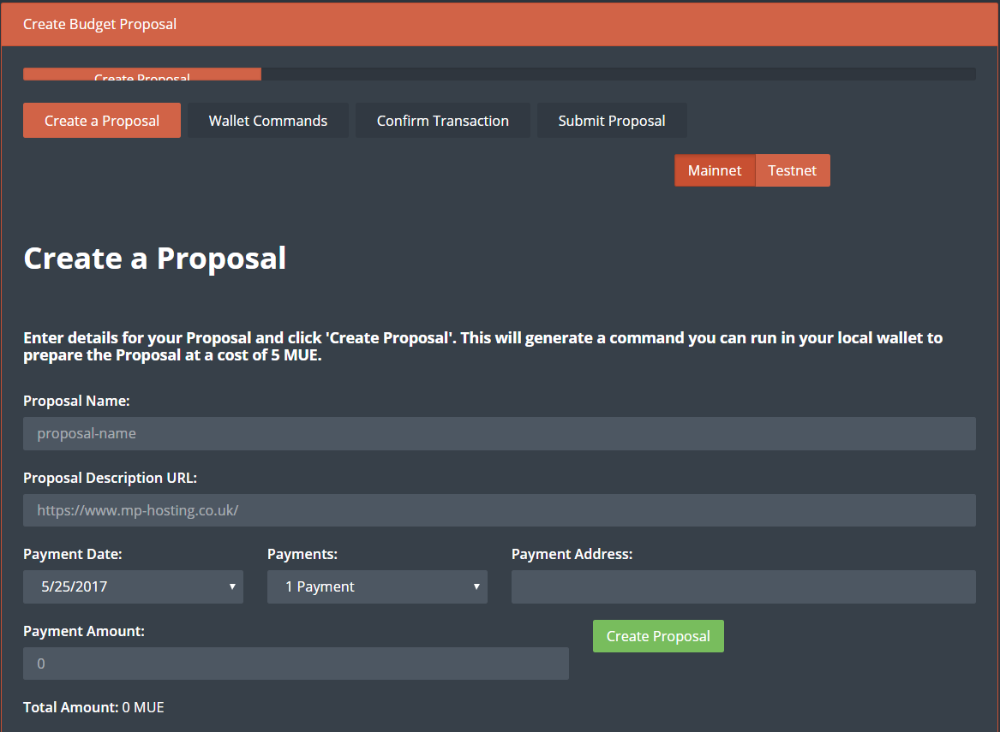
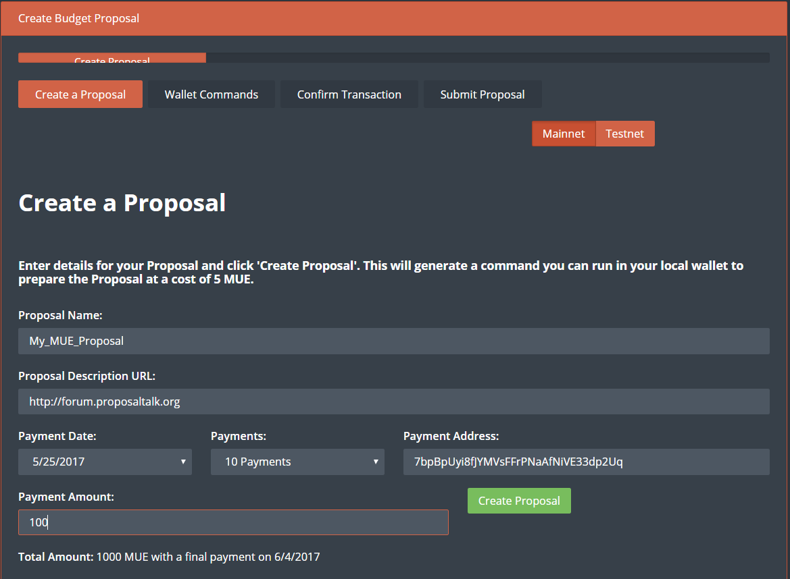
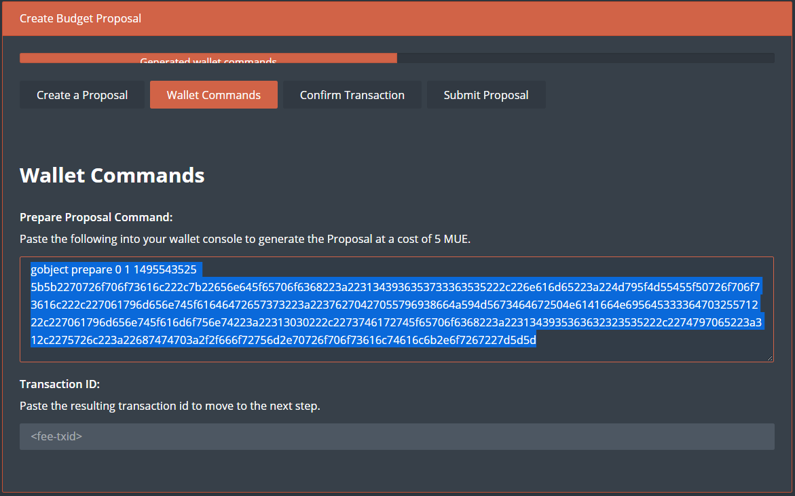

# Making a proposal with the MonetaryUnit QT wallet

The MonetaryUnit network has adopted a governing model where a 10% portion of the block rewards are used to fund proposals that benefit the MonetaryUnit network and community. It is currently necessary to manually make a proposal with the QT wallet before submitting a proposal output - for the masternode operators to vote for or against. Please see the steps below on how to make a proposal and getting it submitted to the network!

## Initiating a proposal

Let's start by going the MyMue proposal page: https://www.mymue.com/
Create an account and make sure to setup two-factor authentication, 2fa, for your increased security.

Next, please go to the proposal page; https://www.mymue.com/Home/CreateProposal
where we will start by filling in the requested fields and start generating a proposal for the masternode network.

You will need to fill in

    Proposal Name:
    Proposal Description URL:
    Payment Address:

And select

    Payment Date:
    Payments:

So as an example:

It is easy and pretty straightforward to fill out the form. In the fields,
`Payment Amount:` this is how much you want to be paid on each *superblock*
`Payments:`  This is how many payments you want to receive.
`Payment Address:` Your address where payment will be sent to
`Total Amount:` 5000 MUE with a final payment on 6/1/2017
The output here would lead to the proposal being paid 500 MUE, for 10 times, making a total of 5000 MUE.

So after you have filled in the boxes hit

And it will take you to the next page, and the next step

## Pasting outputs in the QT-wallet

The next step is to paste the outputs from the proposal page into the console of the QT-wallet.
Copy the `output` and paste it in the `wallet console`

    gobject prepare 0 1 1495374408 5b5b2270726f706f73616c222c7b22656e645f65706f6368223a2231343936333838343138222c226e616d65223a224d7950726f706f73616c222c227061796d656e745f61646472657373223a2237664456565336446f3352347052545a6d506650694a57755976536d6e4c65793836222c227061796d656e745f616d6f756e74223a22353030222c2273746172745f65706f6368223a2231343935343737303138222c2274797065223a312c2275726c223a2268747470733a2f2f7777772e6d796d75652e636f6d227d5d5d

Hit `Enter` and in the console you will get a new output:

and paste that text in the command box and press enter
it will then give you an out put

you will need to keep the f748d08b9ca3d17519a8ed86143a6cfc3c9d4c5f9bdafefc79b739029c5672a4
for the next step

next goto the transactions page
and you will see that you have sent 5 mue (the cost of the proposal

you will now need to wait for this to have at least 6 confirms

ok next step

go back to the website

and paste in the
f748d08b9ca3d17519a8ed86143a6cfc3c9d4c5f9bdafefc79b739029c5672a4

it will then goto the last step

go back to your debug console
and past the above in to the command box and it will take you to the last step on the website

gobject submit 0 1 1495378128 5b5b2270726f706f73616c222c7b22656e645f65706f6368223a2231343936333838313038222c226e616d65223a224d7950726f706f73616c222c227061796d656e745f61646472657373223a2237664456565336446f3352347052545a6d506650694a57755976536d6e4c65793836222c227061796d656e745f616d6f756e74223a22353030222c2273746172745f65706f6368223a2231343935343736373038222c2274797065223a312c2275726c223a22687474703a2f2f7777772e6d796d75652e636f6d2f486f6d652f43726561746550726f706f73616c227d5d5d

go back to your wallet (debug screen)
and paste the output of the last screen

gobject submit 0 1 1495378128 5b5b2270726f706f73616c222c7b22656e645f65706f6368223a2231343936333838313038222c226e616d65223a224d7950726f706f73616c222c227061796d656e745f61646472657373223a22376e454174376a61334153685168723658547546564e6f34326b46706364554e3238222c227061796d656e745f616d6f756e74223a22353030222c2273746172745f65706f6368223a2231343935343736373038222c2274797065223a312c2275726c223a22687474703a2f2f7777772e6d796d75652e636f6d2f486f6d652f43726561746550726f706f73616c227d5d5d 15f807f41c7f4830e742d737a0563be259aa639e864d92c5d020b8a73394d221

this will give you this

a3a20b66f646db23323ded9b6ba06613a6d8f314c995bc73396a0d28de47e535

now to get other to vote you need to give them the correct command
to  vote yes

gobject vote-many  a3a20b66f646db23323ded9b6ba06613a6d8f314c995bc73396a0d28de47e535  funding yes
now depending on how many masternodes you have  the out will vary
I am using 2 in this example

{
  "overall": "Voted successfully 2 time(s) and failed 0 time(s).",
  "detail": {
    "MN3": {
      "result": "success"
    },
    "MN4": {
      "result": "success"
    }
  }
}

so with 10 masternodes  I would get this out put

gobject vote-many  a3a20b66f646db23323ded9b6ba06613a6d8f314c995bc73396a0d28de47e535  funding yes

{
  "overall": "Voted successfully 10 time(s) and failed 0 time(s).",
  "detail": {
    "MN1": {
      "result": "success"
    },
    "MN2": {
      "result": "success"
    },
    "MN3": {
      "result": "success"
    },
    "MN4": {
      "result": "success"
    },
    "MN5": {
      "result": "success"
    },
    "MN6": {
      "result": "success"
    },
    "MN7": {
      "result": "success"
    },
    "MN8": {
      "result": "success"
    },
    "MN9": {
      "result": "success"
    },
    "MN10": {
      "result": "success"
    }
  }
}

to check how your proposal is doing you can check it with this command

gobject get a3a20b66f646db23323ded9b6ba06613a6d8f314c995bc73396a0d28de47e535

{
  "DataHex": "5b5b2270726f706f73616c222c7b22656e645f65706f6368223a2231343936333838313038222c226e616d65223a224d7950726f706f73616c222c227061796d656e745f61646472657373223a22376e454174376a61334153685168723658547546564e6f34326b46706364554e3238222c227061796d656e745f616d6f756e74223a22353030222c2273746172745f65706f6368223a2231343935343736373038222c2274797065223a312c2275726c223a22687474703a2f2f7777772e6d796d75652e636f6d2f486f6d652f43726561746550726f706f73616c227d5d5d",
  "DataString": "[[\"proposal\",{\"end_epoch\":\"1496388108\",\"name\":\"MyProposal\",\"payment_address\":\"7nEAt7ja3AShQhr6XTuFVNo42kFpcdUN28\",\"payment_amount\":\"500\",\"start_epoch\":\"1495476708\",\"type\":1,\"url\":\"https://www.mymue.com/Home/CreateProposal\"}]]",
  "Hash": "a3a20b66f646db23323ded9b6ba06613a6d8f314c995bc73396a0d28de47e535",
  "CollateralHash": "15f807f41c7f4830e742d737a0563be259aa639e864d92c5d020b8a73394d221",
  "ObjectType": 1,
  "CreationTime": 1495378128,
  "FundingResult": {
    "AbsoluteYesCount": 12,
    "YesCount": 12,
    "NoCount": 0,
    "AbstainCount": 0
  },
  "ValidResult": {
    "AbsoluteYesCount": 0,
    "YesCount": 0,
    "NoCount": 0,
    "AbstainCount": 0
  },
  "DeleteResult": {
    "AbsoluteYesCount": 0,
    "YesCount": 0,
    "NoCount": 0,
    "AbstainCount": 0
  },
  "EndorsedResult": {
    "AbsoluteYesCount": 0,
    "YesCount": 0,
    "NoCount": 0,
    "AbstainCount": 0
  },
  "fLocalValidity": true,
  "IsValidReason": "",
  "fCachedValid": true,
  "fCachedFunding": true,
  "fCachedDelete": false,
  "fCachedEndorsed": false
}
